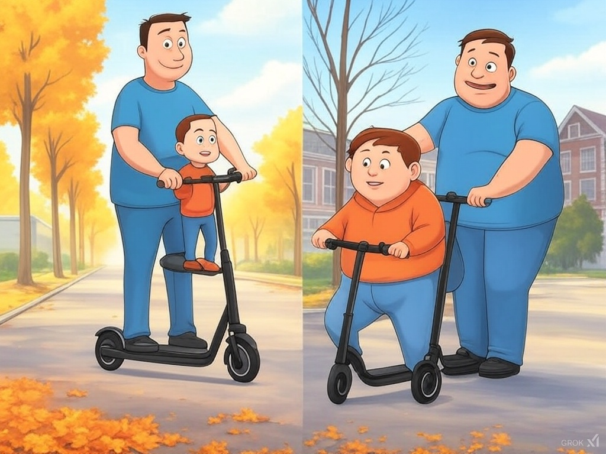

## 提示词

根据下面信息，以“后座少年”为题作一首朦胧诗：

背景：一位父亲每天接送孩子上学，对于同样的刚换上新电池的电瓶车，以前可以接送两个半来回，现在只可以接送一个来回。由此感叹光阴的飞速流逝，孩子越长越大，体重也越来越重。

写作风格：老舍

## openai 版

《后座少年》

电瓶车的铃声，渐渐远去，  
把手上的手，摸不准晨风的温度。  
旧时的轻盈，沉默在电池的电量里，  
今天，却只够一回的路程。

曾经他的小身子，轻如云雾，  
骑在后座，笑声如溪流般清澈；  
而今，  
他已然成了沉甸甸的山丘，  
把我压得有些喘不过气来。

每一圈电池，都比前一圈疲惫，  
我感到，电的劲儿，像光阴一样滑过，  
这骑行的路，不再是走马观花，  
是脚步越来越慢的时光。

他的身影，我曾为他指引前行，  
如今，却是我的背影，  
在他渐长的影子里，  
轻轻变得模糊。

每个早晨，他问：“爸爸，走快点！”  
而我，笑不出来，只听见心里的沉默——  
这一段路，和那电瓶的电量一样，  
只够走一回，  
剩下的，只是倒影里不断拉长的背影。

光阴飞逝，孩子长大，  
我却在这条路上，慢慢老去。

## deepseek 版

《后座少年》

后座上  
你的书包  
一天天鼓胀  
像灌满风的帆

电瓶车的指针  
在红线上徘徊  
曾经轻快的里程  
被你的年轮  
一圈圈碾短

我数着路边的梧桐  
从春数到秋  
你的影子  
在反光镜里  
一节节抽长

电池耗尽的时候  
你也会  
驶向  
更远的站台  
而我的后座  
将永远  
空着  
一个  
春天的重量

## X 版

《后座少年》

电瓶车吱吱作响，旧日的轻快已逝，

新电池的欢歌，怎敌岁月无声的碾压？

晨光微醺，父亲驼着少年，路旁黄叶飘零，

当年两圈半的笑声，如今一圈半的叹息。

后座的影子，渐长渐重，似秋风卷起的尘土，

小手曾紧握父亲肩头，如今双腿垂坠，压弯了时光。

电瓶的低鸣，诉说电池的疲惫，

却掩不住父亲眼底那抹模糊的忧伤。

树影摇曳，季节更替，少年身躯如山，

电车喘息，父亲背影渐弯，

光阴如电，匆匆掠过，留下一串轮印，

后座的少年，承载的何止体重，竟是岁月的荒凉。
