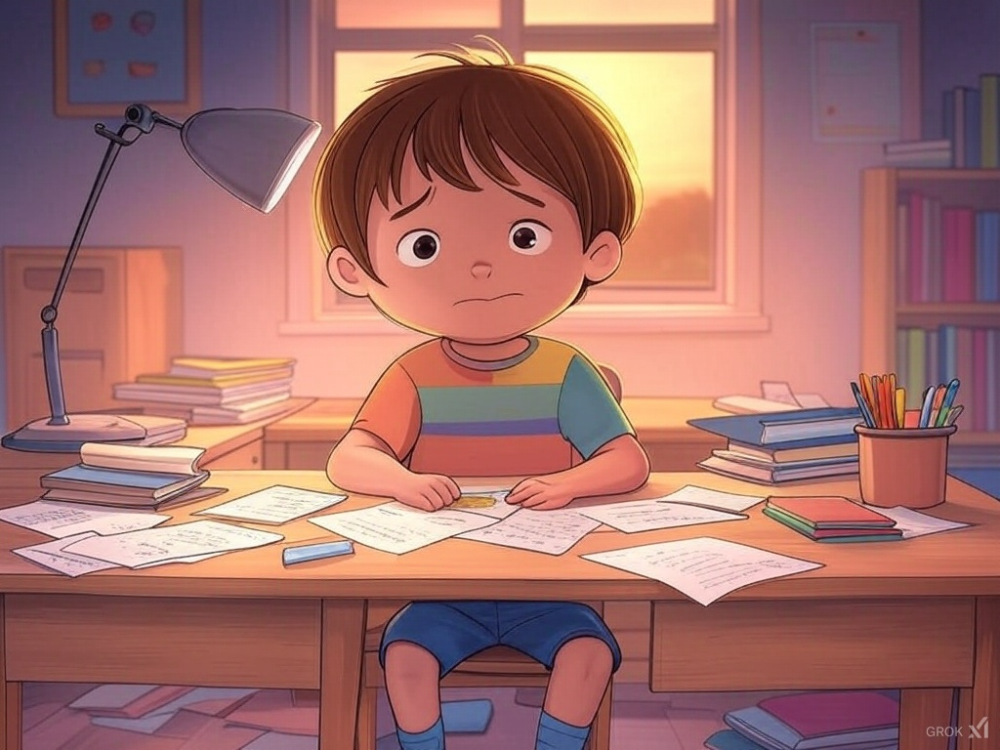
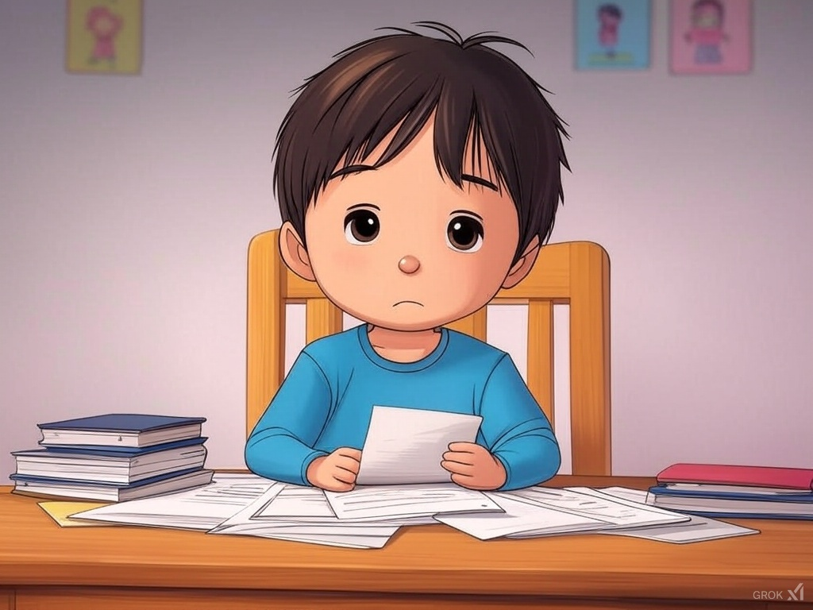

## 纸上的童年

夜色如墨  
沉沉地压下来  
书桌前孩子的影子  
瘦成了一条线

笔尖在纸上沙沙作响  
像是秋风扫过枯叶  
又像是时光在叹息

白日的风筝早已断了线  
飘落在不知名的角落  
只剩堆积如山的习题  
每一页都写满了“努力”  
却找不到一丝童年的痕迹

“快写吧，明天还要早起”  
母亲的声音温柔却无力  
像一盏昏黄的灯照亮了书桌  
却照不亮孩子的眼睛

别处的孩子或许此刻早已入梦  
他们在梦中的草地上奔跑  
追逐蝴蝶、仰望星空  
这里的孩子却在书桌前  
与时间赛跑、与困倦抗争

读书本为点亮心灵的火炬  
为何成了压垮童年的巨石  
这里追求分数、追求名校  
似乎忘了孩子的笑容与健康  
才是最宝贵的财富

孩子的笔终于停在夜的深处  
他揉了揉酸涩的眼睛  
望向窗外的星光点点  
它们仿佛在问他：  
“何时才是尽头？”

